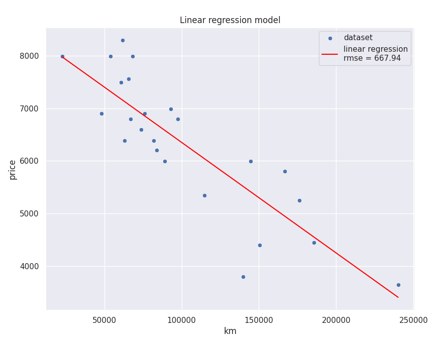

# ft_linear_regression

Hi! This is my 42 cursus project, ft_linear_regression.
The objective was to implement the gradient descent algorithm from scratch and use it to train a linear regression model that predict a car price based on its mileage.

## Usage

> [!NOTE]
> To run the program from source, you need to have `uv` installed on your system.
> https://docs.astral.sh/uv/getting-started/installation/

To train the model
```bash
uv run sources/train.py
```

To make predictions
```bash
uv run sources/predict.py
```

To plot the model
```bash
uv run sources/bonus.py
```

## Explanations

The first step is to define our loss function. Here I am using the [Mean Squared Error](https://en.wikipedia.org/wiki/Mean_squared_error) (MSE) definition.
Note that the factor $\frac{1}{2n}$ is used instead of $\frac{1}{n}$ to simplify the gradient calculation.

$f(a, b) = \frac{1}{2n} \sum_{i=0}^{n-1} (a \cdot mileage(i) + b - price(i))^2$

Now that we have the loss function, we need to compute the partial derivatives with respect to $a$ and $b$ in order to calculate the gradient and minimize the loss.

Let:

$u_i = a \cdot mileage(i) + b - price(i)$

Then by using the [chain rule](https://en.wikipedia.org/wiki/Chain_rule):

$\frac{\partial f}{\partial a} = 2 \cdot \frac{1}{2n} \sum_{i=0}^{n-1} u_iu_i'$

$\frac{\partial f}{\partial b} = 2 \cdot \frac{1}{2n} \sum_{i=0}^{n-1} u_iu_i'$

$\frac{\partial f}{\partial a} = \frac{1}{n} \sum_{i=0}^{n-1} (a \cdot mileage(i) + b - price(i)) \cdot mileage(i)$

$\frac{\partial f}{\partial b} = \frac{1}{n} \sum_{i=0}^{n-1} a \cdot mileage(i) + b - price(i)$

## Result



## Ressources

[StatQuest: Gradient Descent, Step-by-Step](https://www.youtube.com/watch?v=sDv4f4s2SB8)

[Eugene Khutoryansky: Gradients and Partial Derivatives](https://www.youtube.com/watch?v=GkB4vW16QHI)
